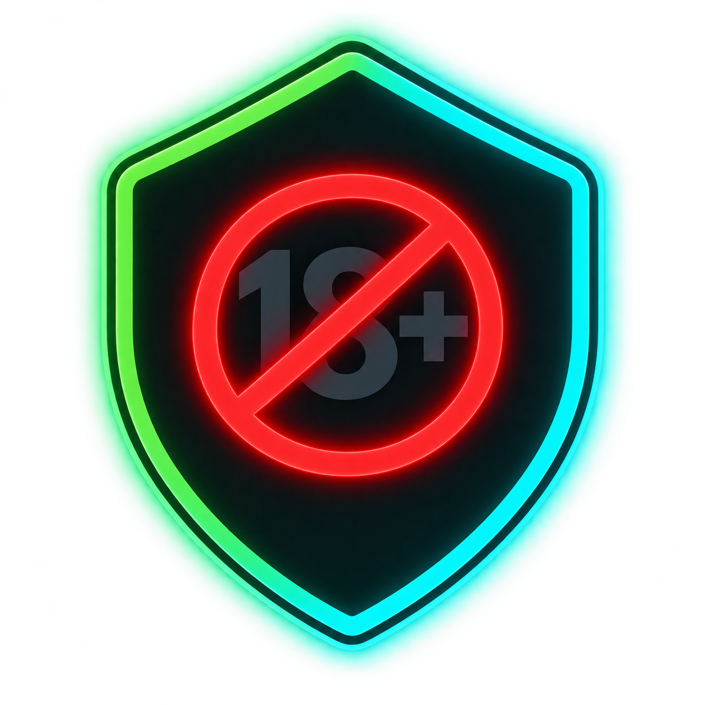

<p align="center">
  
</p>

<h2 align="center">Blocker</h2>

A tamper-resistant, system-wide DNS content filter for Linux.</br>
Brought to you by <b>[Shell Ninja](https://github.com/shell-ninja)</b> — who didn't trust themselves with sudo rights.</br>

---

Blocker is a single C++ binary that filters adult content at the DNS level, system-wide. No browser extension, no per-app config — it intercepts DNS and redirects blocked sites before the browser even connects. Rebooting doesn't help the user bypass it either; the unlock timer resets on every restart.

## How it works

- Runs a local DNS proxy on `127.0.0.1:53` — blocked names resolve to loopback, everything else is forwarded to Cloudflare Families (`1.1.1.3`)
- Blocked sites get a `302` redirect to a YouTube video instead of an error page
- Rules are stored scrambled in a root-only vault — no readable file to delete
- A systemd watchdog restarts the daemon within 1 second if it's killed; `systemctl stop blocker` is refused
- Any change that loosens protection (removing rules, stopping the service, uninstalling) requires a password **and** a 72-hour waiting period. The timer resets on every reboot.

## Requirements

- Linux with systemd (Debian, Ubuntu, Fedora, Arch, etc.)
- `g++` ≥ 9 (or clang ≥ 10) and GNU `make`
- No third-party libraries

## Install

Clone the repo and run the setup script. That's it — it builds, installs, and verifies everything in one step.

```sh
git clone https://github.com/shell-ninja/blocker.git
cd blocker
chmod +x setup.sh
./setup.sh
```

For the full accountability setup (let someone else hold the password):

```sh
./setup.sh --random-password --delay-hours 72
```

The script will:
1. Check that your system meets the requirements
2. Build the binary (`build/blocker`)
3. Ask for confirmation
4. Enable and start the systemd service
5. Verify that blocking works


## Setup options

| Option | What it does |
|---|---|
| `--random-password` | Generate a 24-character password (print once, hand to someone else) |
| `--delay-hours N` | Hours to wait after `unlock-request` before changes are allowed (default 24) |
| `--mode password\|delay\|both` | How changes are gated. `both` = password + waiting period |
| `--no-firewall` | Skip the nftables DNS-bypass rules |
| `--build-only` | Just compile, install nothing |
| `--upgrade` | Replace an existing install |
| `--dry-run` | Show what would happen without doing anything |

## Adding / removing rules

Tightening (blocking more) needs no password:

```sh
sudo blocker add badsite.com '*.ads' kw:gambling
sudo blocker add --file ~/extra-list.txt
```

Loosening (allowing something) needs the password and the unlock window:

```sh
sudo blocker unlock-request     # starts the countdown
# wait the configured delay...
sudo blocker allow example.com  # allowed once the window opens
```

Check if a site is blocked and why:

```sh
sudo blocker check somethingfishy.net
sudo blocker list                        # show all current rules (needs unlock)
```

## Upgrading

```sh
./setup.sh --upgrade
```

This stops the running daemon (needs the unlock password/window), installs the new binary, and keeps your password, config, and rules.

## Uninstall

```sh
sudo blocker uninstall
```

Needs the unlock password and the delay window, same as any other loosening.
